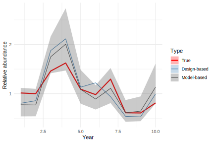
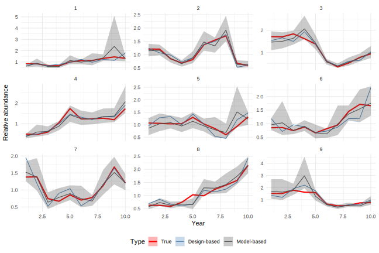

```{=html}
<style>

@import url('https://fonts.googleapis.com/css?family=Montserrat');

.forceBreak { -webkit-column-break-after: always; break-after: column; }

</style>
```
```{r setup, include=FALSE}
knitr::opts_chunk$set(echo = FALSE,
                      message = FALSE,
                      warning = FALSE, 
                      fig.width = 10, 
                      fig.height = 5.2)
```


```{r data, include = FALSE}

# xaringan::inf_mr()

library(here)
library(SimSurvey)
library(sdmTMB)

## wrapper for layout with some different defaults for this slideshow
tight_layout <- function(p, 
                         plot_bgcolor = "transparent",
                         paper_bgcolor = "transparent",
                         margin = list(l = 0, r = 0, t = 0, b = 0, pad = 0),
                         font = list(size = 14, family = "'Montserrat', sans-serif"), 
                         ..., data = NULL) {
  layout(p, plot_bgcolor = plot_bgcolor, paper_bgcolor = paper_bgcolor,
         margin = margin, font = font, ..., data = data)
}

```

## Fisheries-independent surveys {.columns-2}

- Conducted by many RFMOs
- Becoming increasingly important in stock assessment
- Associated with difficult questions:
    - How many fish are in the sea?
    - Where are they located?
    - How should we sample the population?
    - How should we analyze these data?

<p class="forceBreak">

</p>

<br>

<font size="1"> 
<br>
&nbsp; <a href="https://twitter.com/coastguardcan/status/879410397790515201">Canadian Coast Guard | Twitter</a>
</font>


## The pursuit of answers {.columns-2}

<!-- luckly, we are standing on the sholders of giants...theory and principles of sampling were developed by Fisher and Neyman in the 1930s -->

- Long history behind the design and analysis of fisheries-independent surveys
  - A design-based approach is common
    - e.g., Stratified sampling and analysis
  - Model-based approaches are gaining traction
    - e.g., [VAST](https://github.com/James-Thorson-NOAA/VAST), [sdmTMB](https://github.com/pbs-assess/sdmTMB)

<p class="forceBreak">

</p>


<font size="1"> 
<br>
&nbsp; <a href="https://archive.nafo.int/open/studies/s2/doubleday.pdf">Doubleday (1981). Manual on Groundfish Surveys in the Northwest Atlantic</a>
</font>


## Recurring debate {.columns-2 .build}

<div class="centered">

**Design-based approach**

<!-- empirical - focused on the randomness from the random sampling design -->

<font size="3"> 
J. Neyman
<br>

</font>

<p style="line-height: 1.5em">
<span style="color: green;">Unbiased estimates</span>
<br>
<span style="color: red;">Requires perfect design</span>
</p>

</div>

<p class="forceBreak">

<div class="centered">

**Model-based approach**

<!-- parametric - focused on the randomness from underlying distributional assumptions -->

<font size="3"> 
R. A. Fisher 
<br>

</font>

<p style="line-height: 1.5em">
<span style="color: green;">Flexible and precise</span>
<br>
<span style="color: red;">Requires model assumptions</span>
</p>

</div>


## Recurring debate {.columns-2 .build}

<div class="centered">

**Design-based approach**

<p style="line-height: 1.5em">
<span style="color: red;">Unbiased estimates</span>
<br>
Distribution-free
<br><br>
<span style="color: red;">Requires perfect design</span>
<br>
Surveys are rarely perfect <br> (e.g., gaps in coverage)
</p>
<!-- Adds bias to design-based estimates -->

</div>

<p class="forceBreak">

<div class="centered">

**Model-based approach**

<p style="line-height: 1.5em">
<span style="color: red;">Flexible and precise</span>
<br>
Can account for survey problems
<br><br>
<span style="color: red;">Requires model assumptions</span>
<br>
Assumptions are rarely perfect <br> (normal or abnormal?)
<p>

<!-- Adds bias to model-based estimates -->

</div>


## Possible breakout questions {.build}

- Are there survey designs that result in bias or hyperstability in model-based estimates?
- Can models fill gaps left by flaws in survey design?
- Could survey designs be modified to improve model-based estimates?
- Other?

&nbsp; **Plan:** pursue answers using [sdmTMB](https://github.com/pbs-assess/sdmTMB) and [SimSurvey](https://github.com/PaulRegular/SimSurvey)  


## What is [SimSurvey](https://github.com/PaulRegular/SimSurvey)? {.smaller}

<p>
#### An R package for simulating survey samples from age-structured, spatially-correlated populations
</p>

**Simulation steps:**

1. **Simulate abundance** - `sim_abundance()`
    - Common cohort model

2. **Simulate spatial aggregation** - `sim_distribution()`
    - Includes depth associations and noise correlated across space, years and ages

3. **Simulate survey data** - `sim_survey()`
    - Sample population using stratified random survey
    - These data can be analyzed using `run_strat()` (design-based analysis), or using the [sdmTMB](https://github.com/pbs-assess/sdmTMB) package


## What is [sdmTMB](https://github.com/pbs-assess/sdmTMB)? {.smaller}

<p>
#### An R package for fast and flexible fitting of spatiotemporal species distribution GLMMs with [TMB](https://github.com/kaskr/adcomp)
</p>

**Modeling steps:**

1. **Make an R-INLA "mesh" representing spatial "knots"** - `make_mesh()`
    <!-- - Used to approximate the spatial/spatiotemporal "random field" process -->

2. **Fit a spatiotemporal GLMM** - `sdmTMB()`
    - Implements a geostatistical model using TMB, R-INLA, and Gaussian Markov random fields
    - Function is set up similarly to `glm()`, `lmer()`, or `glmmTMB()`
    
3. **Inspect the model** - `print()`, `tidy()`, `predict()`, `residuals()`, `sdmTMB_cv()`, `sdmTMB_sim()`, `AIC()`
    <!-- - Inspect or extract parameter estimates with `print()` or `tidy()` -->
    <!-- - Check residuals using `residuals()` and built-in methods -->
    <!-- - Plot various types of predictions with `predict()`, possibly with new data -->
    <!-- - Compare models with `AIC()` or `sdmTMB_cv()` or self-simulation test with `sdmTMB_sim()` -->
    
4. **Predict on a grid that represents the survey domain** - `predict()`

5. **Calculate the survey index** - `get_index()`
    - Use `get_index()` to sum the expected density or abundance across the grid and calculate standard errors

<!-- ## What is [sdmTMB](https://github.com/pbs-assess/sdmTMB)? {.smaller} -->

<!-- **Modeling steps continued:** -->

<!-- <ol start=4> -->
<!-- <li> **Predict on a grid that represents the survey domain** - `predict()` -->
<!-- <ul> -->
<!-- <li> `predict(model, newdata = grid, return_tmb_object = TRUE)` -->
<!-- </ul> -->

<!-- <li> **Calculate the survey index** - `get_index()` -->
<!-- <ul> -->
<!-- <li> Use `get_index()` to sum the expected density or abundance across the grid and calculate standard errors -->
<!-- </ul> -->
<!-- </ol> -->

## Example simulated abundance

<div class="centered">


</div>

## Example survey observations

<div class="centered">


</div>

## Example predicted and simulated relative abundance

<div class="centered">


</div>

## Example estimated and true survey index

<div class="centered">



</div>

## Example estimated + true index over 9 replicates

<div class="centered">



</div>
    
## [SimSurvey](https://github.com/PaulRegular/SimSurvey) & [sdmTMB](https://github.com/pbs-assess/sdmTMB)

- **Next steps:** 
  1. Compare and contrast design-based and model-based estimates of the "true" population
  2. Introduce survey problems (e.g., reduce spatial coverage) and repeat 1.
  
- Initial code examples can be found [here](https://github.com/TESA-workshops/sim-geostat-survey), where:
  - [`example.Rmd`](https://github.com/TESA-workshops/sim-geostat-survey/blob/main/example.Rmd) is a walk through of a basic example
  - [`example-rep.R`](https://github.com/TESA-workshops/sim-geostat-survey/blob/main/example-rep.R) is a basic example of simulation testing with replicates


