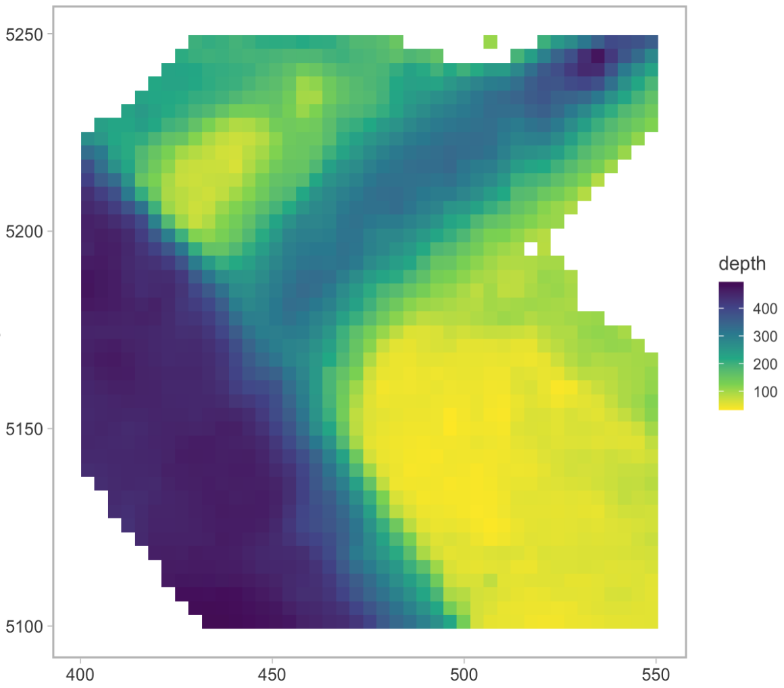
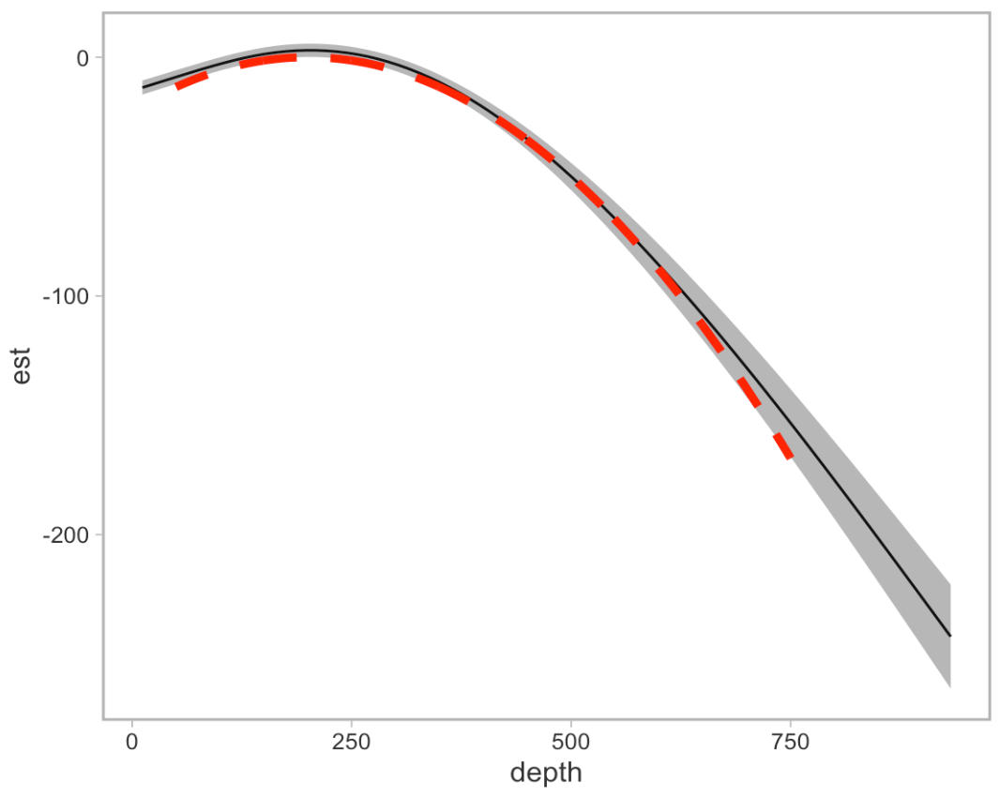
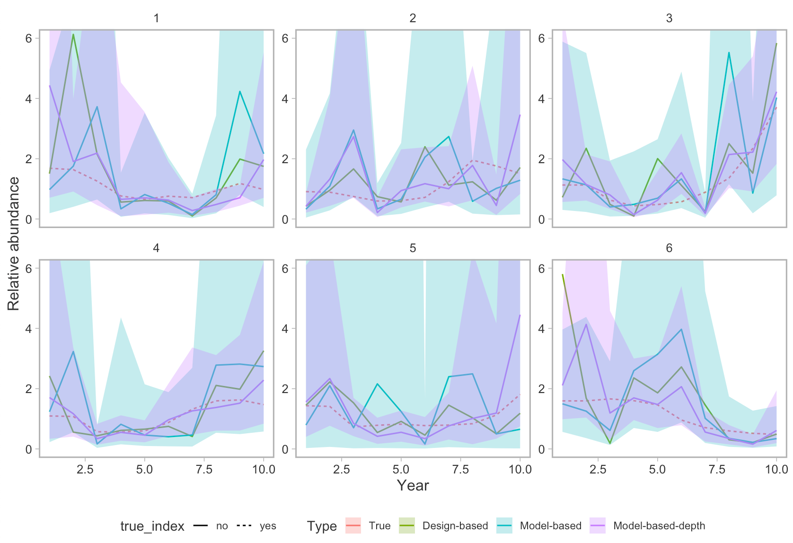
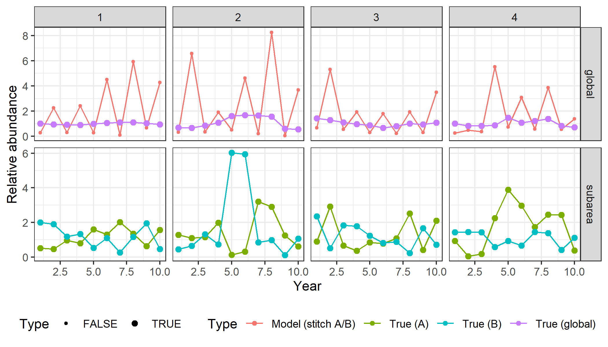
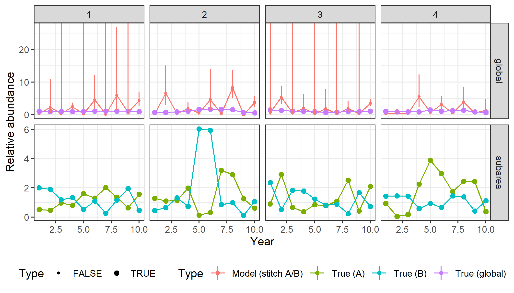
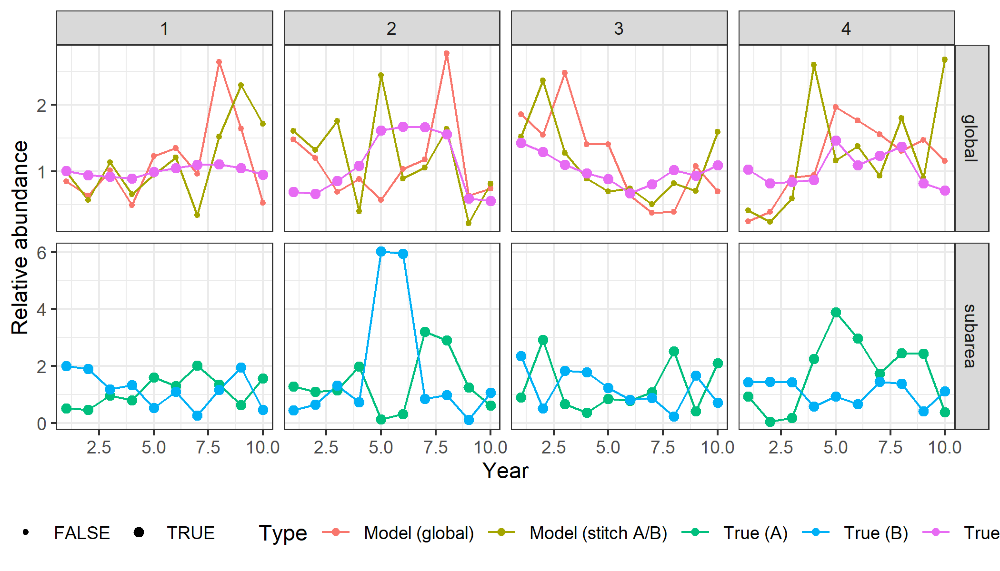
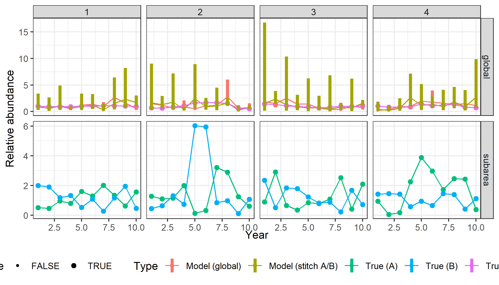

```{r setup, include = FALSE}
library(flextable)
library(dplyr)
```

# Participants

```{r echo = FALSE}

people <- readr::read_lines("
Sean Anderson (Breakout lead)
Paul Regular (Breakout lead)
Alex Hanke,
Brooke Biddlecombe
Dan Ricard
Daniel Duplisea 
Elisabeth Van Beveren
Fatemeh Hatefi
Hannah Munro
Ian Perry
Jordan Ouellette-Plante
Kevin Hedges
Kotaro Ono
Kyle Gillespie
Laura Bianucci
Liza Tsitrin
Marie-Julie Roux
Mark Billard
Mathieu Boudreau
Meghan Burton
Michelle Fitzsimmons
Michelle Greenlaw
Philina English
Quang Huynh
Rajeev Kumar
Ross Tallman
Shani Rousseau
Shannon Obradovich
Stephane Gauthier
Tom Bermingham
Wayne Hajas
Xinhua Zhu
 
", skip_empty_rows = TRUE)

matrix(people, ncol = 3) %>% 
  as.data.frame() %>% 
  flextable() %>% 
  delete_part(part = c("header")) %>% 
  border_remove() %>% 
  fontsize(size = 18) %>% 
  autofit(add_w = 0.5)

```

# The challenge

**General question:** can geostatistical models solve common survey problems?

**Specific focus topics:**

A)  Including covariates. Does including a covariate (depth) increase precision, estimate the right depth relationship, and maintain an unbiased index with greater precision compared to not including any covariates (or any one of these questions)? Are there scenarios where that is or isn't the case?

B)  Changes to spatial coverage from year to year. E.g. If part of the survey (e.g. multiple strata, half the survey area) is missed in some years, can the model recover the index? This includes "hole" filling.

<!-- C)  Does using an AR1 spatiotemporal field (without factor levels for years) constrain the model too much and result in hyperstability? -->

<!-- D)  If the catchability of a survey changed along the time series, say the gear was changed and there was one year of calibration overlap, could the model estimate the catchability (q) offset and provide unbiased estimates of the population available to the contemporary survey as if those gear were used the whole time? -->

E)  If two surveys with different catchabilities are conducted in parallel at neighbouring divisions, could a model 'stitch' these surveys together to provide a unified estimate of the population?

<!-- F)  Are there survey designs that result in the model-based index being more or less precise than the design based index? -->

<!-- G)  Can we obtain an index at age using a geostatistical model? -->

# Other questions

-   Does using an AR1 spatiotemporal field (without factor levels for years) constrain the model too much and result in hyperstability?
-   Are there survey designs that result in the model-based index being more or less precise than the design based index?
-   If the catchability of a survey changed along the time series, say the gear was changed and there was one year of calibration overlap, could the model estimate the catchability (q) offset and provide unbiased estimates of the population available to the contemporary survey as if those gear were used the whole time?
-   Can we obtain an index at age using a geostatistical model?
-   Does the model sufficiently account for spatial correlation and/or is it sufficiently free of assumption so as not to be affected by the stratified sampling design of the survey?

# Approach taken

1.  Simulate a population and a survey and calculate design-based indices using SimSurvey
2.  Fit a geostistical model to the simulated survey data using sdmTMB to obtain model-based indices
3.  Iterate the population simulation and data analysis
4.  Visually assess the bias and precision of the estimates
5.  Modify the simulation settings (e.g., impose partial survey coverage) and repeat setps 1-4

# Key points discussed

-   The capabilities of SimSurvey and sdmTMB
-   Tractable topics to explore
-   Sub-group specific discussions of the focus topics listed in **The challenge** slide

# Successes

-   Prototype code to help kickstart subgroup explorations
-   Preliminary results from each subgroup

# Preliminary results from sub-groups


# Covariates - Philina

<!-- insert notes and plots from covariates sub-group -->
- simulating relationships with depth benefit from realistic depth profiles


- sdmTMB was able to resolve the underlying depth preference (red = true, black = model prediction)


- adding depth can narrow uncertainty in model based estimates (at least when data available to model is very limited)


# Stitching - Quang {.columns=2}

- 1: Surveys A and B each sample different areas in each year
- 2: Surveys A and B each sample different areas in alternate years
- 3: Surveys A and B each sample different areas in alternate years, both sample their respective areas in terminal year
- 4: Same as #3, also compare to situation where survey A samples entire stock area at half the set density (same effort)
- 5: Surveys A and B each sample different areas in alternate years, both sample the same area in terminal year 
- 6: Same vessel samples different areas in alternating years, one year, both surveys sample both areas in terminal year

- Catchability differ between surveys

# Alternating surveys in alternate years with a calibrating year (Q3-4)


# Alternating surveys in alternate years (Q2)



# Alternating surveys in alternate years (Q2)




# Alternating surveys in alternate years with a calibrating year, compare to global survey (Q4)



# Alternating surveys in alternate years with a calibrating year, compare to global survey (Q4)




<!-- insert notes and plots from stitching sub-group -->


# Coverage - Kotaro

<!-- insert notes and plots from Kotaro's coverage sub-group -->


# Covariates - Dan

<!-- insert notes and plots from Dan's covariates sub-group -->


# Challenges

-   Time flies
-   Virtual setting

# How far did we get?

# Next steps

# Expected outcomes
