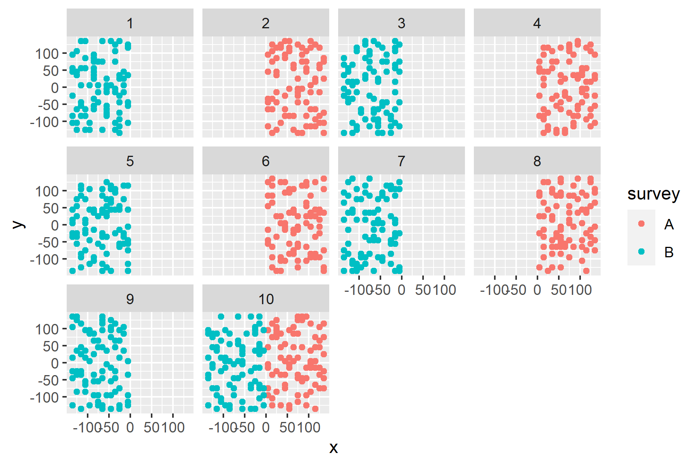
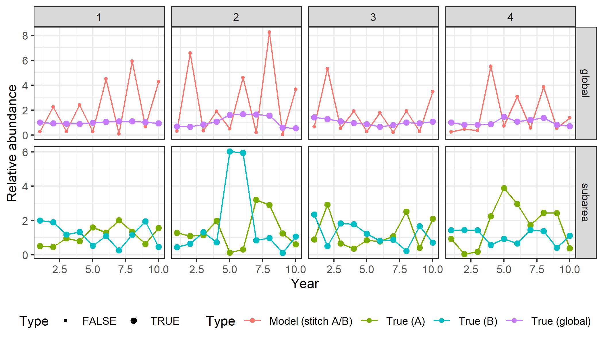
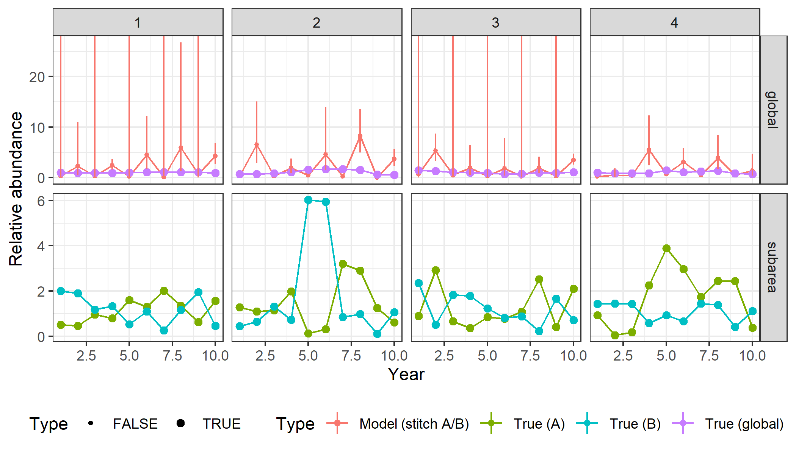
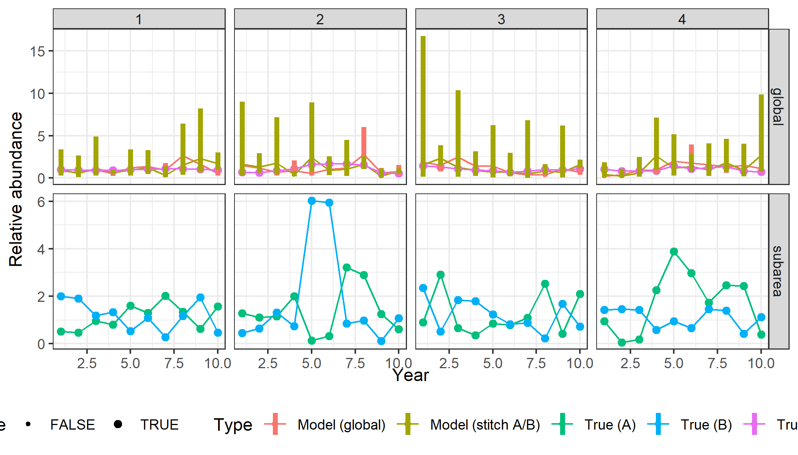

```{r setup, include = FALSE, message=FALSE, warning=FALSE, error=FALSE}
library(dplyr)
library(here)
```

# Participants

```{r echo = FALSE, results='asis'}
p <- tribble(~first, ~last, ~affil, ~role,
"Sean", "Anderson", "DFO Pacific", "Lead",
"Paul", "Regular", "DFO Newfoundland", "Lead",
"Alex", "Hanke", "DFO Gulf", "Participant",
"Brooke", "Biddlecombe", "", "Participant",
"Dan", "Ricard", "DFO Gulf", "Participant",
"Daniel", "Duplisea", "DFO Québec", "Participant",
"Elisabeth", "Van Beveren", "DFO Québec", "Participant",
"Fatemeh", "Hatefi", "", "Participant",
"Hannah", "Munro", "", "Participant",
"Jordan", "Ouellette-Plante", "DFO Québec", "Participant",
"Kevin", "Hedges", "", "Participant",
"Kotaro", "Ono", "", "Participant",
"Kyle", "Gillespie", "", "Participant",
"Laura", "Bianucci", "", "Participant",
"Liza", "Tsitrin", "", "Participant",
"Marie-Julie", "Roux", "DFO Québec", "Participant",
"Mark", "Billard", "", "Participant",
"Mathieu", "Boudreau", "DFO Québec", "Participant",
"Meghan", "Burton", "DFO Pacific", "Participant",
"Michelle", "Fitzsimmons", "", "Participant",
"Michelle", "Greenlaw", "DFO Gulf", "Participant",
"Philina", "English", "DFO Pacific", "Participant",
"Quang", "Huynh", "Blue Matter Science", "Participant",
"Rajeev", "Kumar", "", "Participant",
"Ross", "Tallman", "", "Participant",
"Shani", "Rousseau", "", "Participant",
"Shannon", "Obradovich", "DFO Pacific", "Participant",
"Stephane", "Gauthier", "DFO Pacific", "Participant",
"Tom", "Bermingham", "", "Participant",
"Wayne", "Hajas", "DFO Pacific", "Participant",
"Xinhua", "Zhu", "", "Participant"
)
p %>% arrange(last) %>% 
  mutate(name = paste(first, last)) %>% 
  select(-first, -last, -role) %>%
  select(name, affil) %>% 
  knitr::kable(col.names = c("Name", "Affiliatoin"), booktabs = TRUE, linesep = "")
```

# Background

There has been a recent movement towards geostatistical model-based calibration of survey data to assess trends in species abundance and evaluate distribution shifts.
Such a spatial approach can increase precision compared to design-based approaches and has the potential to account for common survey problems (e.g., gear changes, partial coverage) in calculating indices used in stock assessment.
Furthermore, geostatistical models provide a framework for integrating data from contiguous surveys, meeting an urgent need to track species across survey domains and geopolitical borders as changing ocean conditions cause distributional shifts.
However, skepticism about such approaches remains.
Simulation testing has typically been under ideal conditions (e.g., self-testing with the same underlying model) or non-existent.
Complications exist such as differing length-selectivity and spatiotemporal coverage.

In this breakout group, we proposed joining two major ongoing software development efforts at DFO---one a simulation tool (SimSurvey) and one a model fitting tool (sdmTMB)---to use simulation testing to address several questions around the use of geostatistical model-based calibration of survey data. Specifically, we proposed four subgroups to address the following questions:

1. Does including a covariate (e.g., depth) increase precision, estimate the right depth relationship, and maintain an unbiased index with greater precision compared to not including any covariates? Are there scenarios where that is or isn't the case?

2. Changes to spatial coverage from year to year: If part of the survey (e.g. multiple strata, half the survey area) is missed in some years, can the model recover the index?

3. If two surveys with different catchabilities are conducted in parallel at neighbouring regions, could a model "stitch" these surveys together to provide a unified estimate of the population?


# Methods and results

The general approach taken was to simulate survey data using SimSurvey, fit models to those data using sdmTMB, and then compare the estimated indexes to the known true values over multiple stochastic iterations and under various conditions.

Specifically:

1. Simulate a population and a survey and calculate design-based indices using SimSurvey.
2. Fit a geostistical model to the simulated survey data using sdmTMB to obtain model-based indices.
3. Iterate the population simulation and data analysis.
4. Visually assess the bias and precision of the estimates.
5. Modify the simulation settings (e.g., impose partial survey coverage) and repeat steps 1--4.


# Discussion

# Next steps

# References


# Key points discussed

-   The capabilities of SimSurvey and sdmTMB
-   Tractable topics to explore
-   Sub-group specific discussions of the focus topics listed in **The challenge** slide

# Successes

-   Prototype code to help kickstart subgroup explorations
-   Preliminary results from each subgroup

# Challenges

-   Time flies
-   Virtual setting
-   Black-box effect - reverse engineering what is going on
-   Computational demands
-   Visualizing high-dimensional problem / summarizing results
-   Free-form structure - "This bog is thick and easy to get lost in"

# How far did we get?

-   Lots of brainstorming, some preliminary results

# Next steps

-   Use the tools to gain comfortable
-   Future collaboration to explore important questions

# Expected outcomes

-   Repo with code
-   Some familiarity with these tools
-   Ideas for additional functionality of SimSurvey
-   Sense of potential real-world applications - need more time
-   Lots of interesting questions raised and could be explored


# Preliminary results from sub-groups


# Covariates - Philina

- simulating relationships with depth benefit from realistic depth profiles

```{r, echo = FALSE}
knitr::include_graphics(here("report/real-depth-profile.png"))
```

# Covariates - Philina

- sdmTMB was able to resolve the underlying depth preference (red = true, black = model prediction)

```{r, echo = FALSE}
knitr::include_graphics(here("report/depth-estimate.png"))
```

# Covariates - Philina

- adding depth can narrow uncertainty in model based estimates (at least when data available to model is very limited)

```{r, echo = FALSE}
knitr::include_graphics(here("report/covariate-sims-w-real-depth.png"))
```

# Stitching - Quang

- 1: Surveys A and B each sample different areas in each year
- 2: Surveys A and B each sample different areas in alternate years
- 3: Surveys A and B each sample different areas in alternate years, both sample their respective areas in terminal year
- 4: Same as #3, also compare to situation where survey A samples entire stock area at half the set density (same effort)
- 5: Surveys A and B each sample different areas in alternate years, both sample the same area in terminal year
- 6: Same vessel samples different areas in alternating years, one year, both surveys sample both areas in terminal year

- Catchability differ between surveys

# Alternating surveys in alternate years with a calibrating year (Q3-4)



# Alternating surveys in alternate years (Q2)



# Alternating surveys in alternate years (Q2)




# Alternating surveys in alternate years with a calibrating year, compare to global survey (Q4)


# Alternating surveys in alternate years with a calibrating year, compare to global survey (Q4)




<!-- insert notes and plots from stitching sub-group -->


# Coverage - Kotaro

<!-- insert notes and plots from Kotaro's coverage sub-group -->


# Covariates - Dan

<!-- insert notes and plots from Dan's covariates sub-group -->


